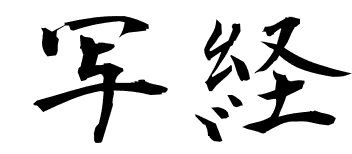

# Shakyo




# About

Shakyo is a tool to learn about something just by typing it.


# Install

```
$ pip install shakyo
```


# Usage

Type `shakyo --help`.


# Example

```
$ cat source_code.py | shakyo
```

```
$ shakyo source_code.py
```

```
$ shakyo https://raw.github.com/raviqqe/shakyo/master/shakyo.py
```

```
$ for you in more less; do cp `which shakyo` `which $you`; done
```


# License

All the contents are released into the public domain.
For more information, see [the unlicense](http://unlicense.org/UNLICENSE).
